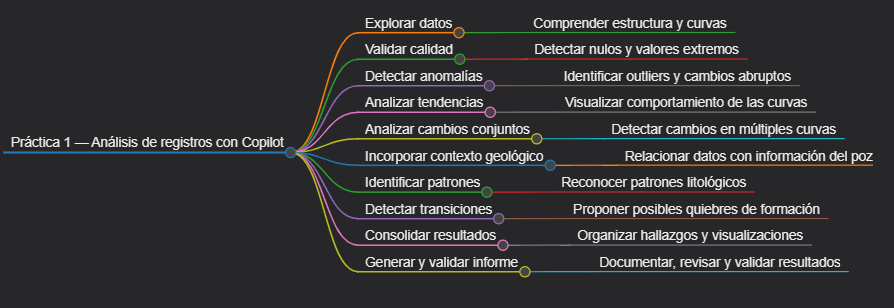
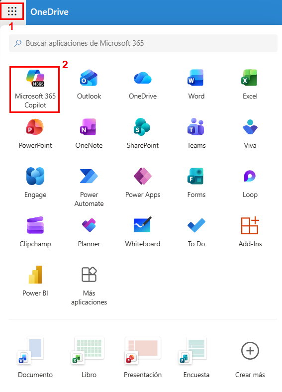
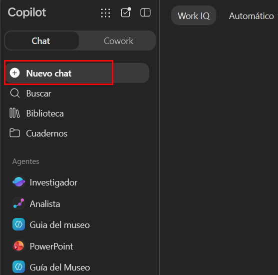
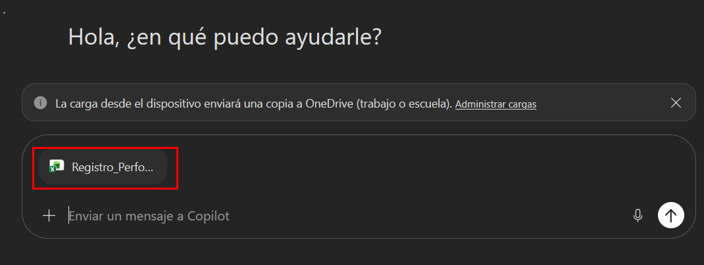
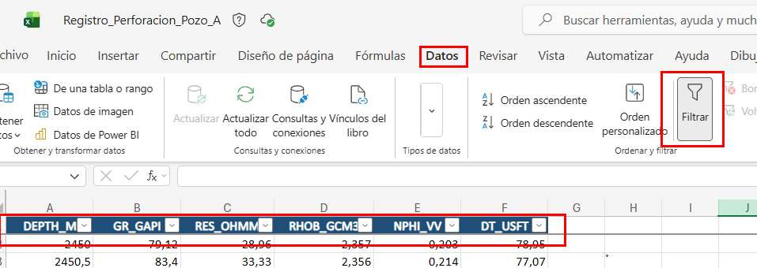
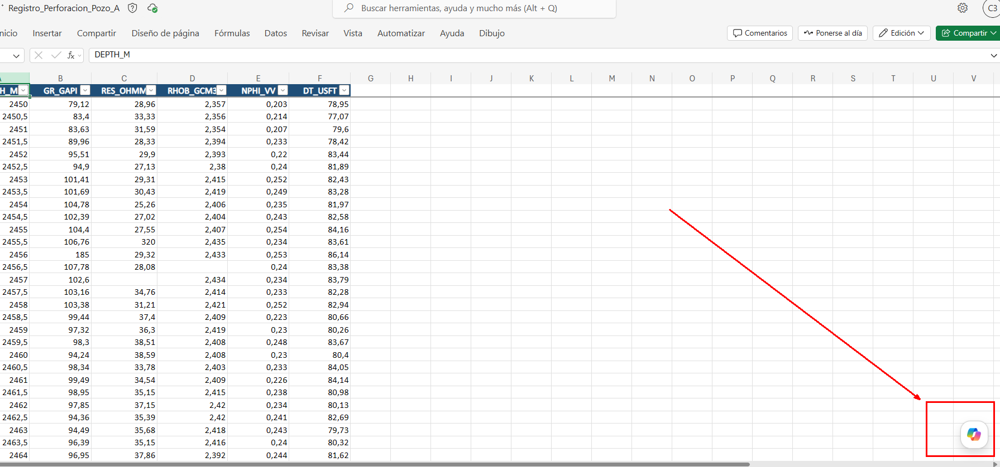
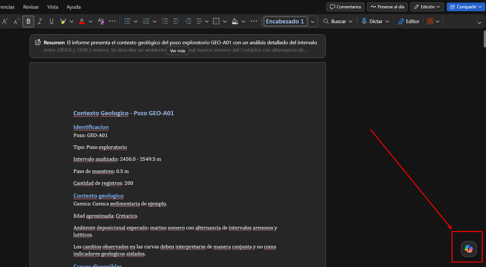
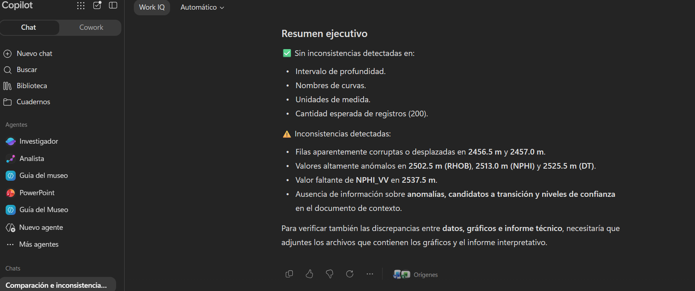

# Práctica 1 — Uso de Copilot para identificar patrones litológicos, quiebres de formación y anomalías en datos programados.

## Objetivo de la práctica:

Al finalizar esta actividad, serás capaz de cargar contexto tabular de un registro de perforación en Copilot Chat y obtener un resumen estructurado de rangos, nulos y anomalías por curva.

## Objetivo Visual



## Duración aproximada:

- 60 minutos

## Instrucciones

### Tarea 1 — Análisis inicial de la estructura del registro

Paso 1. Abrir **Microsoft 365 Copilot Chat** desde OneDrive como se muestra en la imagen



o ingresando con su cuenta desde el siguiente enlace: [Copilot Chat](https://www.bing.com/ck/a?!&&p=8c64e09a2ec677f257cb3fb45118f7351f5d095fcdf56ec40cb8ce634afd8dccJmltdHM9MTc4NjkyNDgwMA&ptn=3&ver=2&hsh=4&fclid=01ccfe72-a649-6473-21f0-e9caa7cf65c5&psq=copilot+chat&u=a1aHR0cHM6Ly9jb3BpbG90LmNsb3VkLm1pY3Jvc29mdC8)

Paso 2. Inicia una conversación nueva



Paso 3. Adjuntar el archivo `Registro_Perforacion_Pozo_A.xlsx` y esperar hasta que el archivo aparezca correctamente asociado a la conversación.



Paso 4. Verificar la estructura del registro mediante el siguiente prompt:

```text
Analiza el archivo Registro_Perforacion_Pozo_A.xlsx.

Antes de interpretar los datos, identifica:

1. Las columnas disponibles.
2. El significado de cada columna.
3. Las unidades utilizadas.
4. La profundidad mínima y máxima.
5. La cantidad total de registros.

Devuelve el resultado en una tabla.

No realices todavía una interpretación geológica.
```

### Tarea 2 — Evaluación de la calidad de datos

Paso 5. Usando el mismo archivo, solicitar estadística básica escribiendo el siguiente prompt:

```text
Analiza las columnas:

- GR_GAPI
- RES_OHMM
- RHOB_GCM3
- NPHI_VV
- DT_USFT

Para cada curva calcula:

- valor mínimo
- valor máximo
- promedio
- cantidad de registros válidos
- cantidad de valores nulos o vacíos

Devuelve una tabla con:

| Curva | Unidad | Mínimo | Máximo | Promedio | Registros válidos | Valores nulos |

No reemplaces los datos faltantes.
```

Paso 6. Para localizar datos nulos:

```text
Para cada valor nulo o vacío identificado anteriormente, indica:

| Curva | Profundidad | Valor anterior | Valor posterior |

No completes ni estimes los valores faltantes.
```

### Tarea 3 — Detección de anomalías (Outliers)

Paso 7. Trabajando con el mismo archivo, identificar outliers:

```text
Analiza las curvas:

- GR_GAPI
- RES_OHMM
- RHOB_GCM3
- NPHI_VV
- DT_USFT

Utiliza el método del rango intercuartílico:

Q1 = percentil 25
Q3 = percentil 75
IQR = Q3 - Q1

Considera candidato a outlier cualquier valor:

- menor que Q1 - 1.5 × IQR
- mayor que Q3 + 1.5 × IQR

No elimines ni modifiques registros.

Devuelve una tabla con:

| Curva | Profundidad | Valor | Q1 | Q3 | IQR | Límite inferior | Límite superior | Tipo de anomalía |
```

---

### Tarea 4 — Análisis detallado de anomalías

Paso 8. Para explicar cada anomalías:

```text
Toma únicamente los outliers identificados anteriormente.

Para cada uno:

1. Indica la profundidad.
2. Indica el valor detectado.
3. Muestra el valor inmediatamente anterior.
4. Muestra el valor inmediatamente posterior.
5. Explica por qué fue marcado como anómalo.
6. Clasifícalo provisionalmente como:
   - posible problema de calidad de datos
   - cambio abrupto que requiere revisión
   - comportamiento que podría formar parte de una tendencia

No realices todavía una interpretación geológica.

Incluye un nivel de confianza: Alta, Media o Baja.
```

---

### Tarea 5 — Verificación manual en Excel

Paso 9. Abrir el archivo `Registro_Perforacion_Pozo_A.xlsx` en Microsoft Excel.

Paso 10. En caso los filtros no esten habilitados como en la imagen mostrada, seleccionar la hoja `Datos_Pozo` y activar filtros desde **Datos > Filtro**.



Paso 11. Utilizar las profundidades entregadas por Copilot para verificar manualmente:

- Los datos nulos
- Los valores anómalos
- Los registros vecinos

**Ejemplo:**

| DEPTH_M |      RES_OHMM |
| ------: | ------------: |
|  2455.0 |            55 |
|  2455.5 | **320** |
|  2456.0 |            51 |

Comprueba que el valor de 320 es efectivamente un outlier comparado con sus vecinos.

---

### Tarea 6 — Análisis de valores extremos con Copilot en Excel

Paso 12. Abrir Microsoft Excel y el archivo `Registro_Perforacion_Pozo_A.xlsx`. Seleccionar la hoja `Datos_Pozo` y hacer clic en cualquier celda de la tabla.

Paso 13. Abrir Copilot desde su icono y verificar que esté trabajando sobre el libro actual.



Paso 14. Solicitar análisis de extremos con el siguiente prompt:

```text
Analiza los datos de esta tabla.

Para cada curva:

- GR_GAPI
- RES_OHMM
- RHOB_GCM3
- NPHI_VV
- DT_USFT

Indica:

- valor mínimo
- profundidad del mínimo
- valor máximo
- profundidad del máximo
- promedio
- si alguno de los extremos parece considerablemente separado del comportamiento general

Devuelve los resultados en una tabla.

No realices todavía interpretación geológica.
```

Paso 15. Profundizar en valores sospechosos con el siguiente prompt:

```text
De los valores extremos identificados anteriormente, selecciona únicamente aquellos que requieran revisión.

Para cada uno compara:

- valor anterior
- valor observado
- valor posterior

Clasifica el comportamiento como:

- extremo normal
- cambio gradual
- cambio abrupto
- valor aislado
- requiere más información

Indica también la profundidad.
```

---

### Tarea 7 — Generar visualizaciones con Copilot en Excel

Paso 16. Solicitar visualización de *Gamma Ray* con el siguiente prompt en Copilot:

```text
Crea una visualización que me permita observar cómo cambia GR_GAPI con respecto a DEPTH_M.

Quiero identificar visualmente:

- tendencias ascendentes
- tendencias descendentes
- cambios abruptos
- puntos aislados

No modifiques los datos originales.
```

Paso 17. Cuando Copilot proponga la visualización, revisar que utilice `DEPTH_M` y `GR_GAPI`. Si ofrece la opción de **Insertar**, seleccionarla y verificar que el gráfico aparezca en el libro.

Paso 18. Solicitar visualización de resistividad con el siguiente prompt:

```text
Ahora crea una visualización de RES_OHMM con respecto a DEPTH_M.

Quiero identificar intervalos estables, cambios abruptos y posibles valores aislados.
```

Paso 19. Comparar RHOB y NPHI con el siguiente prompt:

```text
Crea una visualización que permita comparar RHOB_GCM3 y NPHI_VV respecto de DEPTH_M.

Quiero observar zonas donde ambas curvas cambien simultáneamente o modifiquen su relación.
```

---

### Tarea 8 — Detectar cambios multivariable

Paso 20. Detectar cambios simultáneos en múltiples curvas con el siguiente prompt:

```text
Analiza conjuntamente:

- GR_GAPI
- RES_OHMM
- RHOB_GCM3
- NPHI_VV
- DT_USFT

Busca profundidades o intervalos donde al menos dos curvas presenten cambios aproximadamente simultáneos.

Ignora los valores nulos como evidencia geológica.

Devuelve:

| Profundidad inicial | Profundidad final | Curvas involucradas | Comportamiento anterior | Comportamiento posterior | Tipo de cambio | Confianza |

No realices todavía interpretación litológica.
```

Paso 21. Priorizar los cambios encontrados con el siguiente prompt:

```text
De los cambios encontrados, ordénalos según relevancia.

Utiliza: Alta, Media, Baja

Considera más relevantes aquellos donde:

- intervengan varias curvas
- el cambio sea consistente
- exista continuidad en más de un registro
- no dependa únicamente de un outlier aislado

Explica brevemente la clasificación.
```

---

### Tarea 9 — Diferenciar anomalía de tendencia

Paso 22. Clasificar los cambios identificados con el siguiente prompt:

```text
Revisa los cambios identificados anteriormente.

Para cada uno determina si corresponde principalmente a:

- valor aislado
- cambio abrupto de una sola curva
- tendencia progresiva
- cambio sostenido en varias curvas
- no concluyente

Justifica la clasificación utilizando exclusivamente los datos del libro.

Devuelve:

| Profundidad o intervalo | Curvas | Clasificación | Evidencia | Confianza |
```

---

### Tarea 10 — Incorporar contexto geológico en Word

Paso 23. Abrir `Contexto_Geologico_Pozo_A.docx` en Microsoft Word y seleccionar el icono de **Copilot** como se muestra en la imagen.



Paso 24. Extraer el contexto geológico con el siguiente prompt:

```text
Analiza este documento y extrae únicamente la información relevante para interpretar un registro de perforación.

Organiza la respuesta en:

- identificación del pozo
- intervalo
- contexto geológico
- ambiente deposicional
- litologías esperadas
- información relevante sobre las curvas
- limitaciones del análisis
- advertencias técnicas

No agregues información externa.
```

Paso 25. Crear un resumen técnico con el siguiente prompt:

```text
Resume el contexto geológico anterior en máximo 150 palabras.

El resumen será utilizado posteriormente junto con datos de registros de perforación, por lo que conserva únicamente la información útil para interpretar cambios litológicos y posibles transiciones.
```

---

### Tarea 11 — Relacionar datos con contexto

Paso 26. En Copilot Chat adjuntar ambos archivos:

- `Registro_Perforacion_Pozo_A.xlsx`
- `Contexto_Geologico_Pozo_A.docx`

Paso 27. Solicitar una interpretación conjunta con el siguiente prompt:

```text
Analiza conjuntamente:

Registro_Perforacion_Pozo_A.xlsx

y

Contexto_Geologico_Pozo_A.docx

Utiliza los cambios multivariable observados en los datos y relaciónalos con el contexto geológico.

Para cada intervalo relevante indica:

| Intervalo | Curvas involucradas | Evidencia numérica | Contexto relacionado | Interpretación preliminar | Confianza |

Diferencia claramente:

1. lo que muestran los datos
2. lo que constituye una interpretación geológica

No presentes ninguna interpretación como definitiva.
```

---

### Tarea 12 — Identificar patrones litológicos

Paso 28. Buscar patrones litológicos con el siguiente prompt:

```text
Utilizando los dos archivos adjuntos, busca patrones litológicos reconocibles.

Revisa especialmente:

- tendencias ascendentes de GR
- tendencias descendentes de GR
- comportamiento en bloque
- comportamiento irregular o serrado
- cambios de resistividad
- comportamiento conjunto de RHOB y NPHI

Para cada intervalo indica:

| Intervalo | Patrón observado | Curvas que lo sustentan | Evidencia | Posible interpretación | Confianza |

Si un patrón no es suficientemente claro, indícalo como no concluyente.

No fuerces una clasificación.
```

---

### Tarea 13 — Identificar candidatos a quiebres de formación

Paso 29. Seleccionar los intervalos candidatos a quiebre de formación con el siguiente prompt:

```text
Revisa todos los cambios y patrones identificados.

Selecciona únicamente los intervalos que puedan considerarse candidatos a transición o quiebre de formación.

Un candidato debe:

- presentar cambios en al menos dos curvas
- mostrar comportamiento consistente
- no depender únicamente de un dato nulo
- no depender únicamente de un outlier aislado
- ser compatible con el contexto geológico

Devuelve:

| Profundidad candidata | Curvas involucradas | Evidencia antes | Evidencia después | Patrón asociado | Contexto geológico | Motivo | Confianza |

No presentes ningún candidato como confirmado.
```

---

### Tarea 14 — Consolidar hallazgos en Excel

Paso 30. En el libro `Registro_Perforacion_Pozo_A.xlsx`, crear una hoja nueva llamada `Hallazgos_Copilot`.

Paso 31. En Copilot de Excel, solicitar la creación de la tabla con el siguiente prompt:

```text
Ayúdame a crear una tabla en la hoja Hallazgos_Copilot para registrar los resultados del análisis.

La tabla debe tener estas columnas:

| ID | Tipo de hallazgo | Profundidad inicial | Profundidad final | Curvas involucradas | Evidencia | Interpretación preliminar | Confianza | Requiere validación |
```

Paso 32. Utilizar los resultados obtenidos previamente para completar la tabla. Si Copilot dispone del contexto de los análisis dentro del libro, solicitar:

```text
Organiza los hallazgos identificados en este libro dentro de la tabla Hallazgos_Copilot.

Clasifícalos como:

- dato nulo
- anomalía estadística
- cambio abrupto
- tendencia
- cambio multivariable

No inventes hallazgos adicionales.
```

---

### Tarea 15 — Generar el informe técnico

Paso 33. Abrir Word, crear un documento nuevo y guardarlo como `Informe_Practica_01_Pozo_A.docx`.

Paso 34. Seleccionar **Copilot**, cargar los archivos `Registro_Perforacion_Pozo_A.xlsx` y `Contexto_Geologico_Pozo_A.docx` y solicitar el borrador con el siguiente prompt:

```text
Crea un informe técnico de la práctica de análisis de registros de perforación.

Utiliza como referencia:

- Registro_Perforacion_Pozo_A.xlsx
- Contexto_Geologico_Pozo_A.docx

Estructúralo en:

1. Objetivo
2. Datos analizados
3. Calidad de los datos
4. Valores nulos
5. Anomalías
6. Tendencias
7. Cambios multivariable
8. Patrones litológicos
9. Candidatos a transiciones
10. Limitaciones
11. Conclusiones

Diferencia siempre entre observación e interpretación.

No inventes resultados.
```

---

### Tarea 16 — Revisar técnicamente el informe

Paso 35. Solicitar revisión técnica del informe con el siguiente prompt:

```text
Revisa este informe.

Identifica afirmaciones que:

- presenten una hipótesis como certeza
- confundan un outlier con una anomalía geológica
- consideren un cambio de una sola curva como un quiebre
- no estén respaldadas por evidencia
- tengan un nivel de confianza injustificado

Devuelve una tabla:

| Sección | Afirmación | Problema | Corrección recomendada |

No modifiques todavía el documento.
```

---

### Tarea 17 — Mejorar la redacción del informe

Paso 36. Solicitar mejora de redacción con el siguiente prompt:

```text
Mejora la redacción de este informe manteniendo exactamente:

- valores
- profundidades
- nombres de curvas
- niveles de confianza
- hallazgos técnicos

Mejora únicamente:

- claridad
- ortografía
- estructura
- consistencia terminológica
- tono técnico profesional
```

---

### Tarea 18 — Generar resumen ejecutivo

Paso 37. Solicitar el resumen ejecutivo con el siguiente prompt:

```text
Genera un resumen ejecutivo de máximo 200 palabras basado únicamente en este informe.

Incluye:

- calidad general del registro
- anomalías relevantes
- patrones identificados
- cambios multivariable
- candidatos a transición
- necesidad de validación geológica

No introduzcas información nueva.
```

---

### Tarea 19 — Crear gráficos de análisis en Excel

Paso 38. En el libro `Registro_Perforacion_Pozo_A.xlsx`, crear una hoja nueva llamada `Graficos_Analisis`.

Paso 39. En Copilot de Excel, generar el gráfico de anomalías detectadas con el siguiente prompt:

```text
En la hoja Graficos_Analisis, crea una visualización que muestre:

- Profundidad (eje X)
- Valores de cada curva (eje Y)
- Resaltar con colores diferentes los outliers detectados

Curvas a graficar:
- GR_GAPI
- RES_OHMM
- RHOB_GCM3
- NPHI_VV
- DT_USFT

Usa colores para distinguir valores anómalos de normales.
No modifiques los datos originales.
```

Paso 40. Generar el gráfico de cambios multivariable con el siguiente prompt:

```text
Crea un gráfico que muestre los intervalos donde ocurren cambios simultáneos en múltiples curvas.

Marcar con rectángulos o sombreado los intervalos de profundidad donde se detectaron cambios multivariable.

Etiqueta cada intervalo con:
- Profundidad inicial
- Profundidad final
- Tipo de cambio
- Nivel de confianza
```

Paso 41. Generar la tabla resumen visual con el siguiente prompt:

```text
Crea una tabla visual en la hoja Graficos_Analisis que resuma:

| Hallazgo | Profundidad | Curvas | Tipo | Confianza | Acción |

Organiza por:
1. Datos nulos
2. Anomalías
3. Cambios multivariable
4. Candidatos a transición

Usa formato condicional con colores según confianza (Alta=verde, Media=amarillo, Baja=rojo).
```

---

### Tarea 20 — Validación cruzada final

Paso 42. Añadir los tres archivos a Copilot Chat:

- `Registro_Perforacion_Pozo_A.xlsx` (con hojas de Hallazgos y Gráficos)
- `Contexto_Geologico_Pozo_A.docx`
- `Informe_Practica_01_Pozo_A.docx`

Paso 43. Solicitar revisión de consistencia con el siguiente prompt:

```text
Compara estos archivos:

- Registro_Perforacion_Pozo_A.xlsx (hojas: Datos_Pozo, Hallazgos_Copilot, Graficos_Analisis)
- Contexto_Geologico_Pozo_A.docx
- Informe_Practica_01_Pozo_A.docx

Busca inconsistencias entre los datos originales, los gráficos y el informe técnico.

Comprueba específicamente:

- profundidades en gráficos vs. tablas
- valores reportados vs. visualización
- nombres de curvas
- anomalías identificadas
- candidatos a transición
- niveles de confianza

Devuelve:

| Elemento | Ubicación | Inconsistencia | Corrección recomendada |

Si no existe inconsistencia, indícalo explícitamente.
```

---

## Resultado Esperado

