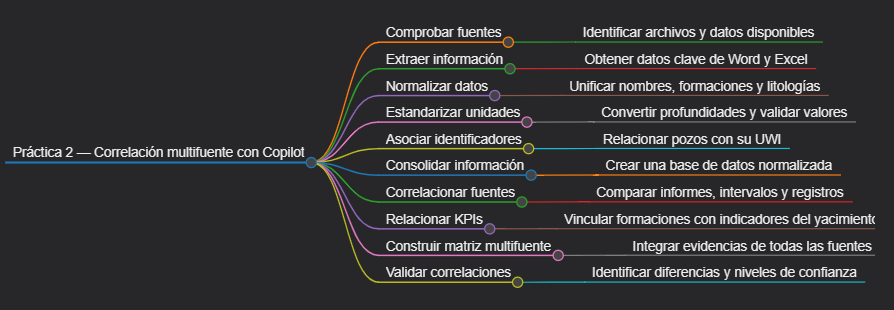
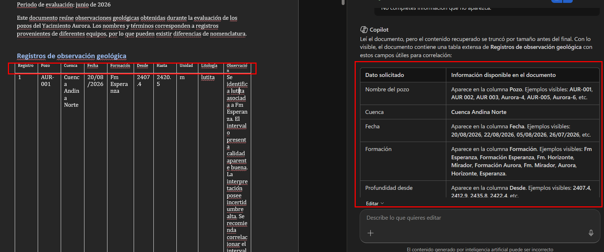
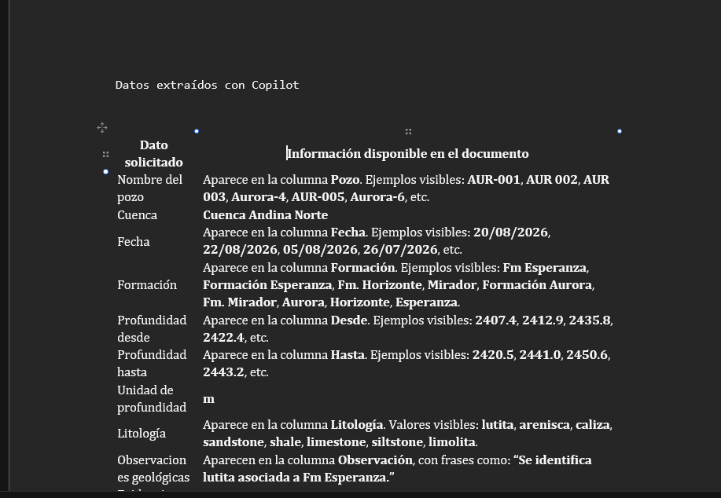
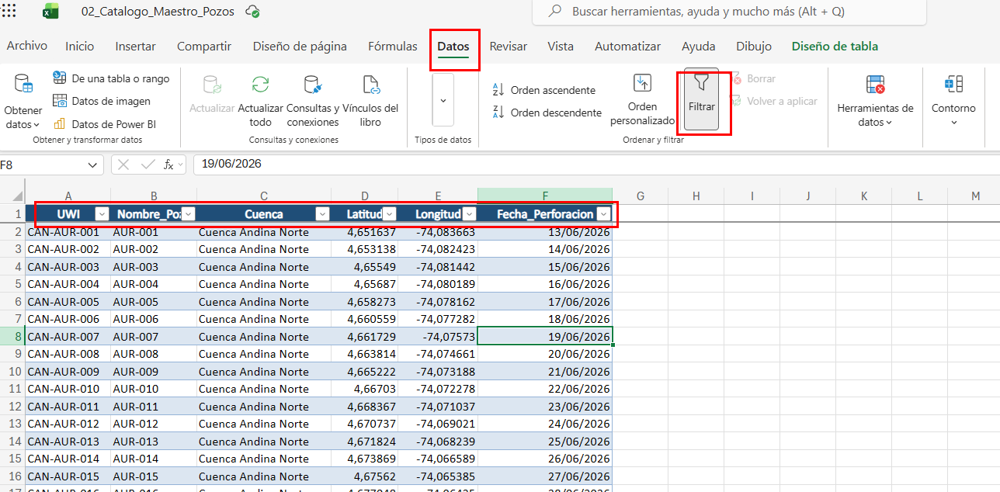
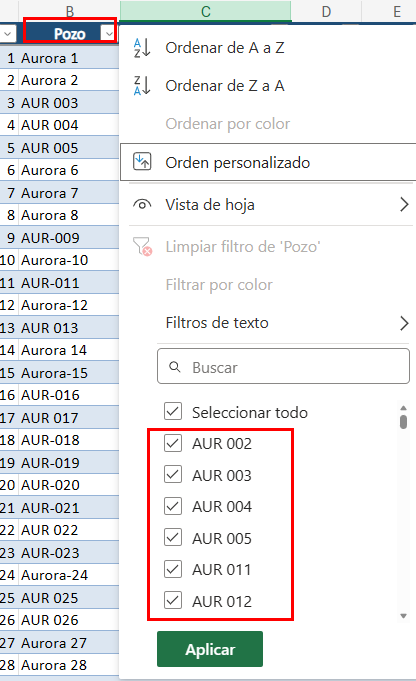
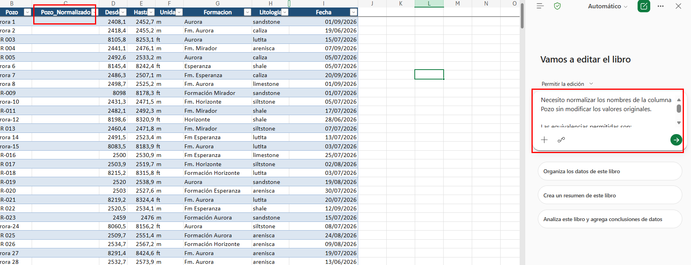
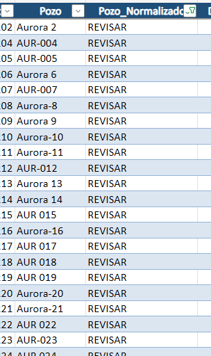
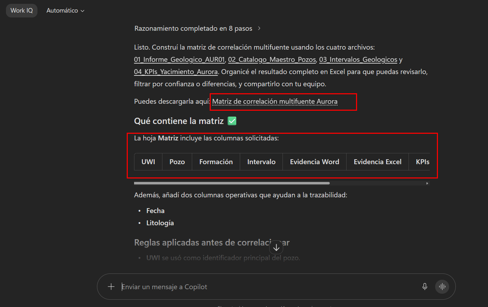

# Práctica 2 — Cómo usar Copilot para correlacionar datos de diferentes fuentes y generar resúmenes ejecutivos de cuencas o yacimientos en segundos

## Objetivo de la práctica:

Al final de la actividad, serás capaz de aplicar el flujo de trabajo de correlación multifuente (ingesta → extracción → normalización → correlación → validación) en Copilot Chat con documentos geológicos heterogéneos.

## Objetivo Visual



## Duración aproximada:

- 50 minutos.

## Instrucciones

### Tarea 1 — Comprobación de fuentes con Copilot

Paso 1. Verifique visualmente que estén disponibles los cuatro archivos:

```text
01_Informe_Geologico_AUR01.docx
02_Catalogo_Maestro_Pozos.xlsx
03_Intervalos_Geologicos.xlsx
04_KPIs_Yacimiento_Aurora.xlsx
```

Paso 2. Abra **Microsoft 365 Copilot Chat**, inicie una conversación nueva y utilice la opción para **agregar contenido o archivos de trabajo**. Seleccione los cuatro archivos anteriormente mencionados.

Paso 3. Pida explícitamente el inventario a Copilot:

```text
Trabaja exclusivamente con los cuatro archivos que acabo de proporcionar.

Primero necesito que construyas un inventario de las fuentes antes de realizar cualquier correlación.

Revisa individualmente cada archivo y devuelve una tabla con:

- Nombre del archivo
- Tipo de archivo
- Tipo de información encontrada
- Nombre o nombres de pozos mencionados
- UWI encontrados
- Cuenca
- Formaciones mencionadas
- Fechas encontradas
- Campos o variables principales
- Información faltante que podría dificultar una correlación posterior

No normalices nombres todavía.
No combines registros todavía.
No interpretes geológicamente los datos.
Si un dato no aparece, escribe "No disponible".
```

---

### Tarea 2 — Extraer los datos del informe geológico con Copilot en Word

Paso 4. Desde OneDrive o SharePoint, abra `01_Informe_Geologico_AUR01.docx` en **Microsoft Word** y abra el panel de **Copilot** dentro de Word.

Paso 5. Pida la extracción de datos del informe geológico con Copilot:

```text
Analiza únicamente este documento.

Extrae todos los datos que puedan utilizarse posteriormente para correlacionarlo con otras fuentes.

Busca explícitamente:

- Nombre del pozo
- Cuenca
- Fecha
- Formación
- Profundidad desde
- Profundidad hasta
- Unidad de profundidad
- Litología
- Observaciones geológicas
- Evidencias sobre calidad del reservorio
- Riesgos o incertidumbres mencionadas
- Recomendaciones

Devuelve el resultado en una tabla.

No cambies los nombres utilizados en el documento.
No conviertas unidades todavía.
No completes información que no aparezca.
```

Paso 6. Revise el resultado y compare la tabla generada con el texto original. Por ejemplo, deberá aparecer información equivalente a lo siguiente:



Paso 7. Debajo del contenido original del documento puede crear temporalmente una sección denominada `Datos extraídos con Copilot` y pegar allí la tabla generada. Esto permitirá posteriormente comparar la extracción con las otras fuentes.



---

### Tarea 3 — Analizar el catálogo maestro de pozos con Copilot en Excel

Paso 8. Abra el archivo `02_Catalogo_Maestro_Pozos.xlsx`.

Paso 9. Si los datos todavía no están en formato de tabla, seleccione una celda dentro de los datos y presione `Ctrl + T`. Confirme que está seleccionada la opción **La tabla tiene encabezados** y pulse **Aceptar**. Esto facilita que Copilot interprete correctamente las columnas.



Paso 10. Abra Copilot en Excel y pida que identifique la estructura:

```text
Analiza la tabla de esta hoja.

Identifica:

- UWI
- Nombre oficial del pozo
- Cuenca
- Latitud
- Longitud
- Fecha de perforación

Devuelve una tabla resumida.

Después indica qué columna debería utilizarse como identificador único para correlacionar otros archivos y explica brevemente por qué.

No modifiques todavía los datos.
```

---

### Tarea 4 — Buscar variantes de nombres de pozos en Excel utilizando filtros y Copilot

Paso 11. Abra el archivo `03_Intervalos_Geologicos.xlsx`. Si todavía no es una tabla, conviértalo presionando `Ctrl + T`, activando **La tabla tiene encabezados** y pulsando **Aceptar**.

Paso 12. Localice la columna `Pozo`, pulse la flecha del filtro situada en el encabezado y observe los valores que aparecen en la lista (por ejemplo: Aurora-1, AUR-01, AUR-02, Aurora 3). No seleccione todavía ninguna opción y cierre el filtro. El objetivo no es ocultar filas, sino ver qué variantes existen.



Paso 13. Solicite el análisis a Copilot en Excel:

```text
Revisa todos los valores de la columna Pozo de esta tabla.

Compáralos conceptualmente con los nombres oficiales del catálogo maestro:

AUR-01
AUR-02
AUR-03

Identifica posibles variantes de un mismo pozo.

Devuelve:

Valor original | Posible nombre oficial | Motivo de la equivalencia | Confianza

No cambies todavía las celdas.
```

---

### Tarea 5 — Crear una columna de nombre normalizado con ayuda de Copilot

Paso 14. En el archivo `03_Intervalos_Geologicos.xlsx`, agregue una columna al lado de `Pozo` con el nombre `Pozo_Normalizado`.

Paso 15. Pida la fórmula a Copilot:

```text
Necesito normalizar los nombres de la columna Pozo sin modificar los valores originales.

Las equivalencias permitidas son:

Aurora-1 = AUR-01
AUR-01 = AUR-01
AUR-02 = AUR-02
Aurora 3 = AUR-03

Indícame una fórmula de Excel para completar la columna Pozo_Normalizado aplicando exactamente estas equivalencias.

Si aparece un nombre distinto a los anteriores, la fórmula debe devolver "REVISAR".
```



Paso 16. Copie la fórmula propuesta por Copilot y colóquela en la primera celda de `Pozo_Normalizado`. Excel debería propagar la fórmula automáticamente. Si no lo hace, arrastre la fórmula hacia abajo.



Paso 17. Abra el filtro de `Pozo_Normalizado`, desmarque **Seleccionar todo** y seleccione únicamente `REVISAR`. Si aparecen filas, significa que todavía existen nombres que requieren intervención humana. Pida ayuda a Copilot sobre esas filas:

```text
Revisa las filas actualmente visibles cuyo Pozo_Normalizado es "REVISAR".

Para cada una indica:

- nombre original
- posible correspondencia con el catálogo maestro
- evidencia utilizada
- si puede normalizarse con confianza o requiere revisión humana
```

---

### Tarea 6 — Normalizar las formaciones con Copilot en Excel

Paso 18. En el archivo `03_Intervalos_Geologicos.xlsx`, abra el filtro de `Formacion` y revise las variantes existentes (por ejemplo: Fm. Esperanza, Formación Esperanza, Esperanza, Fm Esperanza). Cierre el filtro sin modificar las filas.

Paso 19. Agregue una nueva columna llamada `Formacion_Normalizada`.

Paso 20. Solicite la regla a Copilot:

```text
En esta tabla existen distintas maneras de nombrar la misma formación.

Normaliza únicamente estas variantes:

"Fm. Esperanza" → "Formación Esperanza"
"Formación Esperanza" → "Formación Esperanza"
"Esperanza" → "Formación Esperanza"
"Fm Esperanza" → "Formación Esperanza"

Genera una fórmula para la columna Formacion_Normalizada.

Cualquier otro valor debe quedar como "REVISAR".
```

Paso 21. Copie la fórmula y complete toda la columna.

Paso 22. Compruebe si hay pendientes utilizando el filtro de `Formacion_Normalizada` para seleccionar solamente `REVISAR`. Si existen registros, solicite a Copilot:

```text
Analiza únicamente las filas visibles marcadas como REVISAR.

Indica si corresponden a alguna formación ya conocida o si deben permanecer pendientes de validación.
```

---

### Tarea 7 — Normalizar las litologías

Paso 23. En el archivo `03_Intervalos_Geologicos.xlsx`, abra el filtro de `Litologia` y observe los términos existentes (por ejemplo: sandstone, arenisca, shale, lutita).

Paso 24. Agregue una nueva columna llamada `Litologia_Normalizada`.

Paso 25. Pida la fórmula a Copilot:

```text
Normaliza la columna Litologia aplicando únicamente estas equivalencias:

sandstone → arenisca
arenisca → arenisca
shale → lutita
lutita → lutita

Genera una fórmula para completar Litologia_Normalizada.

Si aparece un término diferente, devuelve "REVISAR".
```

Paso 26. Identifique excepciones utilizando el filtro de `Litologia_Normalizada` para mostrar solamente `REVISAR`. Luego pregunte a Copilot:

```text
Revisa las litologías actualmente visibles marcadas como REVISAR.

No las traduzcas automáticamente.

Indica para cada término:

- posible significado
- posible equivalente dentro de los términos ya utilizados
- si requiere validación geológica
```

---

### Tarea 8 — Detectar registros en pies y convertirlos a metros

Paso 27. En el archivo `03_Intervalos_Geologicos.xlsx`, localice la columna `Unidad`, abra el filtro, desmarque **Seleccionar todo** y seleccione `ft`. Excel mostrará únicamente las filas expresadas en pies.

Paso 28. Pregunte a Copilot:

```text
Las filas actualmente visibles están expresadas en pies.

Necesito crear dos nuevas columnas:

Desde_m
Hasta_m

Indícame las fórmulas de Excel necesarias para convertir Desde y Hasta de pies a metros.

Las filas que ya estén en metros deben conservar su valor original.
```

Paso 29. Abra nuevamente el filtro de `Unidad` y seleccione **Borrar filtro**.

Paso 30. Agregue las columnas `Desde_m` y `Hasta_m` y copie las fórmulas proporcionadas por Copilot.

Paso 31. Valide con Copilot preguntando:

```text
Revisa las columnas Desde, Hasta, Unidad, Desde_m y Hasta_m.

Detecta:

- conversiones incorrectas
- intervalos donde Desde_m sea mayor que Hasta_m
- valores nulos
- profundidades que parezcan atípicas respecto a los demás registros

Devuelve una tabla de incidencias sin modificar los datos.
```

---

### Tarea 9 — Asociar cada registro con su UWI

Paso 32. Mantenga abiertos los archivos `02_Catalogo_Maestro_Pozos.xlsx` y `03_Intervalos_Geologicos.xlsx`.

Paso 33. En el archivo `03_Intervalos_Geologicos.xlsx`, pida a Copilot la estrategia:

```text
Necesito asociar a cada valor de Pozo_Normalizado su UWI utilizando como referencia el archivo 02_Catalogo_Maestro_Pozos.xlsx.

El nombre oficial del pozo está en la columna Nombre_Pozo del catálogo.

Indícame cómo hacerlo en Excel utilizando BUSCARX.

El resultado debe almacenarse en una nueva columna llamada UWI.

Si no existe coincidencia, debe devolver "NO ENCONTRADO".
```

Paso 34. Inserte la columna `UWI` y aplique la fórmula indicada por Copilot.

Paso 35. Abra el filtro de la nueva columna `UWI` y seleccione únicamente `NO ENCONTRADO`. Si existen filas, pregunte a Copilot:

```text
Analiza las filas visibles que no obtuvieron UWI.

Compara Pozo y Pozo_Normalizado e indica por qué BUSCARX no encontró coincidencia y qué debería revisarse.
```

---

### Tarea 10 — Crear una hoja consolidada para la correlación

Paso 36. Dentro de `03_Intervalos_Geologicos.xlsx` cree una hoja llamada `Datos_Normalizados`.

Paso 37. Indique a Copilot qué columnas deben conservarse preguntando:

```text
Quiero crear una tabla consolidada para correlacionar información con otros documentos.

De la tabla actual necesito conservar únicamente:

- UWI
- Pozo_Normalizado
- Formacion_Normalizada
- Desde_m
- Hasta_m
- Litologia_Normalizada
- Fecha

Indícame cómo copiar estas columnas a una nueva hoja llamada Datos_Normalizados manteniendo los encabezados.
```

Paso 38. Realice la copia indicada, seleccione los datos de `Datos_Normalizados` y presione `Ctrl + T` para convertirlos en tabla, confirmando que contiene encabezados.

---

### Tarea 11 — Correlacionar el informe Word con los intervalos normalizados usando Copilot Chat

Paso 39. Inicie una nueva conversación en Copilot Chat y agregue únicamente:

```text
01_Informe_Geologico_AUR01.docx
03_Intervalos_Geologicos.xlsx
```

Paso 40. Dé a Copilot las reglas explícitas:

```text
Quiero correlacionar el informe geológico con la hoja Datos_Normalizados del archivo Excel.

Realiza la correlación siguiendo exactamente este orden:

1. Identifica el nombre del pozo mencionado en el informe.
2. Busca su equivalente en Pozo_Normalizado.
3. Confirma el UWI correspondiente.
4. Identifica las formaciones mencionadas en el informe.
5. Compáralas con Formacion_Normalizada.
6. Extrae los intervalos de profundidad mencionados en Word.
7. Compáralos con Desde_m y Hasta_m del Excel.
8. Compara las litologías descritas con Litologia_Normalizada.
9. Compara las fechas disponibles.

Para cada posible relación devuelve:

Dato del informe | Registro del Excel | Coincidencia | Diferencia | Confianza | Justificación

Utiliza únicamente:
Alta
Media
Baja

No declares una coincidencia alta si no existe evidencia en más de un campo.
```

---

### Tarea 12 — Correlacionar los KPIs con las formaciones

Paso 41. Seleccione y agregue los dos archivos a Copilot:

```text
03_Intervalos_Geologicos.xlsx
04_KPIs_Yacimiento_Aurora.xlsx
```

Paso 42. Solicite la correlación escribiendo:

```text
Relaciona las formaciones de la hoja Datos_Normalizados de 03_Intervalos_Geologicos.xlsx con la tabla de KPIs del archivo 04_KPIs_Yacimiento_Aurora.xlsx.

Realiza estas acciones:

1. Lista las formaciones normalizadas encontradas en el archivo de intervalos.
2. Busca cada formación en la columna Formacion del archivo de KPIs.
3. Para cada coincidencia recupera:
   - NetPay_m
   - Porosidad_pct
   - Perm_mD
   - TOC_pct
   - Riesgo_Geologico
4. Señala las formaciones que no tengan KPIs.
5. Señala los KPIs que no puedan relacionarse con ninguna formación de los intervalos.

Devuelve una tabla.

No asumas equivalencias nuevas sin indicarlas.
```

---

### Tarea 13 — Crear una matriz de correlación multifuente

Paso 43. Abra Copilot Chat y seleccione los cuatro archivos:

```text
01_Informe_Geologico_AUR01.docx
02_Catalogo_Maestro_Pozos.xlsx
03_Intervalos_Geologicos.xlsx
04_KPIs_Yacimiento_Aurora.xlsx
```

Paso 44. Solicite la matriz final escribiendo:

```text
Construye una matriz de correlación multifuente utilizando los cuatro archivos.

Antes de correlacionar:

1. Utiliza UWI como identificador principal del pozo.
2. Si una fuente no contiene UWI, utiliza el nombre normalizado obtenido a partir del catálogo.
3. Utiliza Formación Esperanza como nombre canónico cuando corresponda.
4. Utiliza profundidades en metros.
5. Utiliza arenisca y lutita como términos litológicos normalizados.

Después correlaciona por:

- pozo
- formación
- intervalo
- fecha
- litología
- KPIs disponibles

Devuelve:

UWI | Pozo | Formación | Intervalo | Evidencia Word | Evidencia Excel | KPIs relacionados | Diferencias | Confianza
```

---

## Resultado Esperado

