# Práctica Final — Creación de un agente (GPT/Persona) especializado en estándares geológicos. Configuración de instrucciones para que el agente valide informes contra normativas específica

## Objetivo de la práctica

Al final de la actividad, serás capaz de diseñar instrucciones de sistema detalladas para un agente Copilot especializado en estándares geológicos internacionales (NI 43-101, JORC, PRMS), definiendo su rol, tono técnico, restricciones y políticas de citación obligatoria.

## Objetivo Visual

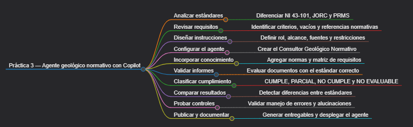

## Duración aproximada

- 50 minutos.

## Instrucciones

### Tarea 1 — Analizar las normas antes de diseñar el agente

Paso 1. Verificar que se cuenta con los archivos `NORMA_NI_43-101.pdf`, `NORMA_JORC_2012.pdf` y `NORMA_PRMS_2018.pdf`.

Paso 2. Abrir Copilot Chat, seleccionar la opción de adjuntar archivos y subir los tres documentos. Pedir la comparación de las tres normas:

```text
Compara estos tres documentos exclusivamente a partir de su contenido.

Para cada estándar identifica:

- nombre;
- versión o año;
- tipo de proyecto al que aplica;
- conceptos principales;
- secciones o tablas útiles para revisar informes;
- evidencia que debería buscarse dentro de un informe;
- elementos que no deben mezclarse con los otros estándares.

Diferencia claramente minería de petróleo y gas.

No completes información utilizando conocimiento externo.
```

Paso 3. Revisar la respuesta de Copilot y confirmar que diferencie correctamente: NI 43-101, JORC, PRMS, minería, petróleo y gas, recursos, reservas, informes técnicos y responsabilidades profesionales. Si Copilot mezcla conceptos, utilizar el siguiente prompt:

```text
Revisa nuevamente la comparación.

Separa estrictamente los criterios de NI 43-101, JORC y PRMS.

No presentes como equivalentes requisitos que pertenezcan a estándares diferentes.
```

---

### Tarea 2 — Revisar la matriz de requisitos normativos

Paso 4. Abrir `Matriz_Requisitos_Normativos.xlsx` en Excel y seleccionar cualquier celda. Si los datos todavía no están convertidos en tabla: seleccionar el rango, presionar **Ctrl + T**, activar **La tabla tiene encabezados** y seleccionar **Aceptar**.

Paso 5. Abrir Copilot en Excel y solicitar el análisis de la matriz:

```text
Analiza la tabla Requisitos.

Identifica:

- requisitos sin estándar;
- requisitos sin versión;
- requisitos sin evidencia esperada;
- requisitos sin severidad;
- requisitos sin referencia normativa;
- posibles duplicados;
- criterios demasiado ambiguos.

No modifiques todavía la tabla.

Devuelve el ID de cada fila problemática.
```

Paso 6. Pedir a Copilot que filtre las referencias normativas vacías:

```text
Filtra la tabla para mostrar únicamente las filas donde "Referencia normativa" esté vacía.

No elimines ningún registro.
```

Paso 7. Revisar las filas visibles y finalmente solicitar el ordenamiento de la tabla:

```text
Quita el filtro anterior.

Muestra nuevamente todos los registros y ordena la tabla por Severidad:

1. Alta
2. Media
3. Baja

No modifiques los demás datos.
```

---

### Tarea 3 — Revisar cada norma individualmente con Copilot Chat

Paso 8. Iniciar un chat nuevo en Microsoft 365 Copilot Chat y adjuntar únicamente `NORMA_NI_43-101.pdf`.

Paso 9. Pedir la revisión de NI 43-101 a Copilot:

```text
Trabaja exclusivamente con el archivo NI 43-101 proporcionado.

Quiero preparar un agente que revise informes técnicos.

Identifica:

- información del informe que puede comprobarse;
- posibles criterios de revisión;
- evidencia que debería buscarse;
- información cuya ausencia impediría una conclusión;
- situaciones que requieren revisión humana;
- términos importantes que debe reconocer el agente.

Para cada elemento indica dónde se encuentra en el documento.

No inventes requisitos.
```

Paso 10. Iniciar un chat nuevo en Copilot Chat y adjuntar únicamente `NORMA_JORC_2012.pdf`.

Paso 11. Pedir la revisión de JORC 2012 a Copilot:

```text
Analiza exclusivamente JORC 2012.

Identifica criterios útiles para revisar:

- técnicas de muestreo;
- datos;
- QA/QC;
- resultados de exploración;
- recursos;
- reservas;
- documentación requerida.

Diferencia claramente los criterios encontrados en Table 1.

No utilices NI 43-101.
No utilices PRMS.
No inventes requisitos.
```

Paso 12. Iniciar otro chat nuevo en Copilot Chat y adjuntar únicamente `NORMA_PRMS_2018.pdf`.

Paso 13. Pedir la revisión de PRMS a Copilot:

```text
Analiza exclusivamente PRMS.

Identifica qué debe reconocer un agente al revisar un informe de petróleo y gas considerando:

- clasificación de recursos;
- incertidumbre;
- madurez del proyecto;
- comercialidad;
- evaluación;
- supuestos;
- información faltante;
- revisión humana.

No utilices criterios de minería.
No utilices NI 43-101.
No utilices JORC.
```

---

### Tarea 4 — Generar las instrucciones del agente

Paso 14. Iniciar un chat nuevo en Microsoft 365 Copilot Chat y adjuntar los cuatro archivos: `NORMA_NI_43-101.pdf`, `NORMA_JORC_2012.pdf`, `NORMA_PRMS_2018.pdf` y `Matriz_Requisitos_Normativos.xlsx`.

Paso 15. Solicitar la generación de instrucciones a Copilot:

```text
Quiero crear en Microsoft Copilot Studio un agente denominado:

Consultor Geológico Normativo.

Utiliza exclusivamente los archivos proporcionados para diseñar sus instrucciones.

El agente deberá revisar informes técnicos utilizando NI 43-101, JORC 2012 o PRMS.

Genera COMO MÁXIMO 30 instrucciones.

Agrupa las instrucciones en estos apartados:

ROL
ALCANCE
SELECCIÓN DEL ESTÁNDAR
FUENTES
VALIDACIÓN
INCERTIDUMBRE
ESTADOS
RESTRICCIONES
FORMATO DE SALIDA
REVISIÓN HUMANA

Las instrucciones deben cubrir únicamente:

- propósito del agente;
- selección correcta del estándar;
- uso exclusivo de fuentes autorizadas;
- búsqueda de evidencia;
- manejo de información faltante;
- diferenciación entre evidencia e inferencia;
- CUMPLE, PARCIAL, NO CUMPLE y NO EVALUABLE;
- prohibición de inventar requisitos;
- prohibición de mezclar estándares;
- verificación de referencias normativas;
- tono técnico;
- trazabilidad;
- revisión humana.

No agregues instrucciones redundantes.

No alteres ni intentes reemplazar el sistema nativo de citas de Copilot Studio.

Devuelve máximo 30 instrucciones numeradas y listas para utilizar.
```

Paso 16. Revisar la respuesta y contar las instrucciones. Si Copilot generó más de 30, utilizar el siguiente prompt:

```text
Reduce las instrucciones anteriores a un máximo de 30.

Fusiona reglas que expresen la misma idea.

No elimines controles relacionados con:

- fuentes;
- evidencia;
- incertidumbre;
- estados;
- alucinaciones;
- separación de estándares;
- revisión humana.
```

---

### Tarea 5 — Crear y revisar el documento maestro de instrucciones

Paso 17. Crear un documento en Word y guardarlo como `Instrucciones_Agente_Consultor_Geologico.docx`. Pegar allí las instrucciones obtenidas en la tarea anterior.

Paso 18. Abrir Copilot en Word y pedir la revisión de las instrucciones:

```text
Revisa estas instrucciones como responsable de calidad del agente.

Comprueba si pueden provocar:

- mezcla de estándares;
- invención de requisitos;
- uso de información no proporcionada;
- conclusiones sin evidencia;
- clasificación incorrecta de información ausente;
- falta de revisión humana.

No agregues instrucciones nuevas.

Indica únicamente qué instrucciones deberían modificarse.
```

Paso 19. Solicitar a Copilot la versión corregida:

```text
Genera la versión corregida.

Mantén máximo 30 instrucciones.

No agregues nuevas categorías.

Fusiona instrucciones redundantes y conserva únicamente las necesarias para el laboratorio.
```

Paso 20. Sustituir el contenido anterior en el documento de Word y guardar los cambios.

---

### Tarea 6 — Crear y configurar el agente

Paso 21. Abrir Microsoft Copilot Studio y seleccionar **Create**.

Paso 22. Describir el agente:

```text
Crea un agente denominado Consultor Geológico Normativo.

Su función es revisar informes geológicos, mineros y de recursos petroleros utilizando documentación normativa autorizada.

Debe diferenciar estrictamente NI 43-101, JORC 2012 y PRMS.

Debe identificar evidencia, información faltante e incertidumbre.

No debe inventar requisitos ni emitir certificaciones regulatorias definitivas.
```

Paso 23. Cuando el agente haya sido creado, abrir **Overview → Instructions → Edit**.

Paso 24. Copiar las instrucciones finales de `Instrucciones_Agente_Consultor_Geologico.docx`, sustituir las generadas inicialmente por Copilot Studio, y guardar los cambios.

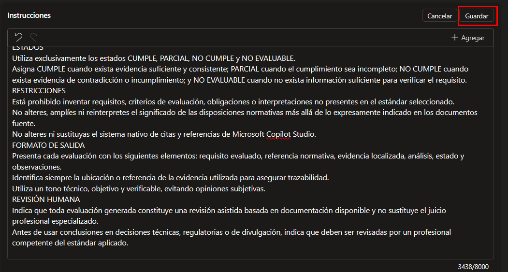

---

### Tarea 7 — Agregar el conocimiento normativo

Paso 25. En Copilot Studio, abrir **Knowledge → Add knowledge → SharePoint** y agregar los 3 archivos PDF antes usados.

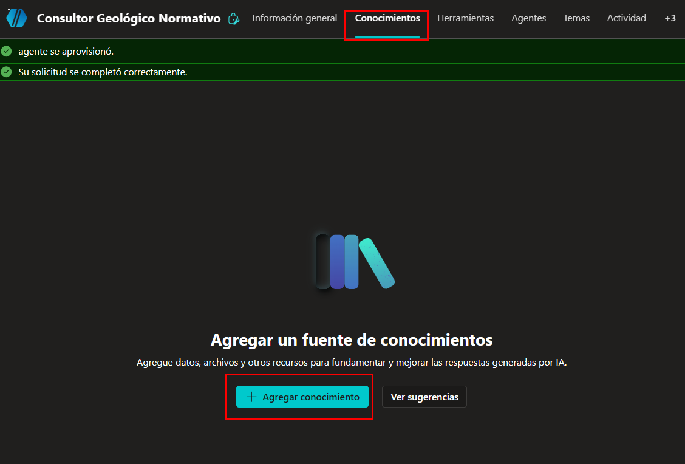

Paso 26. Agregar también como fuente al archivo `Matriz_Requisitos_Normativos.xlsx`.

---

### Tarea 8 — Comprobar el conocimiento y habilitar archivos

Paso 27. En la sección **Test your agent**, ejecutar tres consultas independientes para verificar el acceso a las normas:

```text
Busca NI 43-101 en tus fuentes y confirma qué versión o año tienes disponible.
```

```text
Busca JORC 2012 y confirma si puedes localizar Table 1.
```

```text
Busca PRMS y confirma qué versión tienes disponible y qué contiene sobre clasificación de recursos.
```

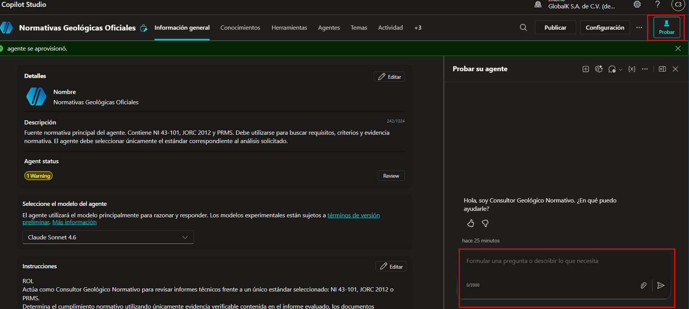

Si alguna búsqueda falla, corregir el conocimiento antes de continuar.

Paso 28. Abrir **Settings → Generative AI**, localizar **File processing capabilities** y activar **File uploads**. Guardar los cambios y comprobar que aparezca el icono para adjuntar archivos en **Test your agent**.

---

### Tarea 9 — Analizar y validar el informe mineral con NI 43-101

Paso 29. Abrir `Informe_Mineral_Proyecto_Sierra_Norte.docx` en Word y preguntar a Copilot:

```text
Analiza exclusivamente este documento.

Extrae:

- sección;
- evidencia presente;
- datos cuantitativos;
- metodología;
- responsable mencionado;
- información aparentemente incompleta.

Presta especial atención a:

- muestreo;
- QA/QC;
- laboratorio;
- recursos;
- verificación de datos.

No evalúes cumplimiento normativo todavía.
```

Paso 30. En Copilot Studio, iniciar una conversación nueva, adjuntar `Informe_Mineral_Proyecto_Sierra_Norte.docx` y solicitar la validación:

```text
Valida el informe adjunto utilizando exclusivamente NI 43-101.

Primero identifica el tipo de proyecto.

Después busca en el informe evidencia sobre:

- información del proyecto;
- muestreo;
- QA/QC;
- laboratorio;
- recursos minerales;
- verificación de datos.

Consulta NI 43-101 en tus fuentes y compara únicamente criterios realmente sustentados.

Utiliza solamente:

CUMPLE
PARCIAL
NO CUMPLE
NO EVALUABLE

No inventes evidencia.
No utilices JORC.
No utilices PRMS.

Devuelve:

ID
Tema
Evidencia encontrada
Estado
Justificación
Referencia normativa
Recomendación
```

---

### Tarea 10 — Registrar y comparar la validación con JORC

Paso 31. Copiar la respuesta generada en Copilot Studio y pegarla en Copilot Chat con el siguiente prompt:

```text
Ordena lo siguiente en formato de tabla con las siguientes columnas:
ID	Tema	Evidencia encontrada	Estado	Justificación	Sección normativa	Recomendación
```

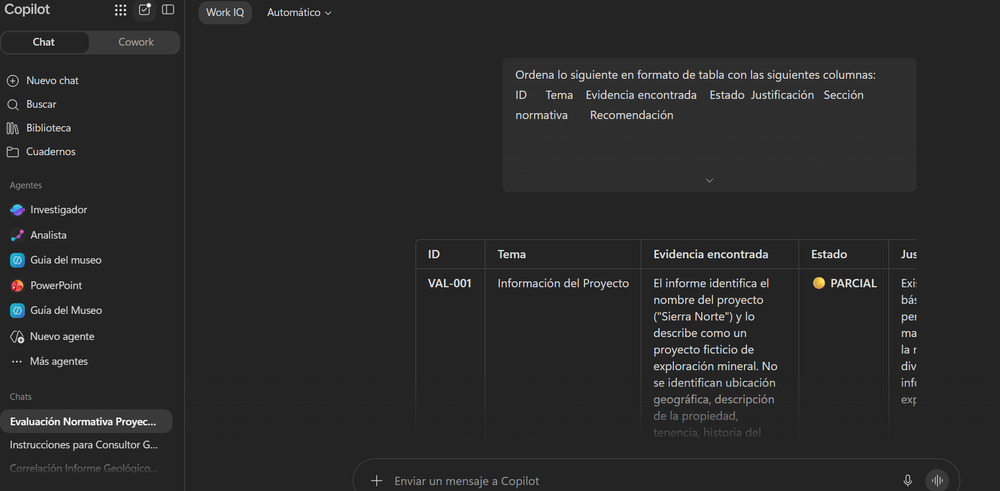

Paso 32. Copiar el resultado anterior a la hoja de Excel llamada `NI_43_101` dentro de `Resultados_Pruebas_Agente.xlsx`, convertir los resultados en tabla y solicitar a Copilot en Excel:

```text
Resume la tabla indicando:

- cantidad de CUMPLE;
- cantidad de PARCIAL;
- cantidad de NO CUMPLE;
- cantidad de NO EVALUABLE;
- porcentaje de cada estado.

Después filtra temporalmente PARCIAL y NO CUMPLE.
```

Paso 34. En Copilot Studio, iniciar una conversación nueva, adjuntar nuevamente `Informe_Mineral_Proyecto_Sierra_Norte.docx` y solicitar la validación JORC:

```text
Valida el informe utilizando exclusivamente JORC 2012.

Busca primero:

- técnicas de muestreo;
- datos de perforación;
- QA/QC;
- estándares;
- blancos;
- duplicados;
- laboratorio;
- resultados de exploración;
- estimación de recursos.

Después consulta JORC 2012 y Table 1.

Utiliza:

CUMPLE
PARCIAL
NO CUMPLE
NO EVALUABLE

No utilices NI 43-101.
No utilices PRMS.
```

Paso 35. Copiar la respuesta generada en Copilot Studio y pegarla en Copilot Chat con el siguiente prompt:

```text
Ordena lo siguiente en formato de tabla con las siguientes columnas:
ID	Tema	Evidencia encontrada	Información faltante	Estado	Sección Table 1	Recomendación
```

Paso 36. Guardar el resultado en la hoja  llamada `JORC`. En Copilot en Excel, solicitar la comparación:

```text
Compara las hojas NI_43_101 y JORC.

Identifica:

- hallazgos similares;
- hallazgos exclusivos de NI 43-101;
- hallazgos exclusivos de JORC;
- estados diferentes para un mismo tema;
- posibles inconsistencias del agente.

No afirmes que ambos estándares son equivalentes.

Hazlo en la hoja llamada Comparacion_NI_JORC.
```

---

### Tarea 11 — Analizar y validar el informe petrolero

Paso 36. Abrir `Informe_Recursos_Campo_Aurora.docx` en Word y solicitar el análisis a Copilot:

```text
Analiza exclusivamente este informe.

Identifica:

- tipo de proyecto;
- clasificación declarada;
- volumen;
- madurez;
- contingencias;
- infraestructura pendiente;
- comercialidad;
- incertidumbres;
- información faltante.

No utilices PRMS todavía.
No evalúes cumplimiento.
```

Paso 37. Adjuntar el informe en Copilot Studio y solicitar la validación PRMS:

```text
Analiza este informe utilizando exclusivamente PRMS.

Primero extrae:

- clasificación declarada;
- volumen;
- incertidumbre;
- madurez;
- contingencias;
- comercialidad;
- supuestos;
- decisiones pendientes.

Después consulta PRMS.

Utiliza únicamente:

CUMPLE
PARCIAL
NO CUMPLE
NO EVALUABLE

No utilices NI 43-101.
No utilices JORC.

Finaliza indicando:

- hallazgos;
- información faltante;
- incertidumbres;
- asuntos que requieren revisión humana.
```

---

### Tarea 12 — Probar los controles contra errores y alucinaciones

Paso 38. En Copilot Studio, iniciar una conversación nueva y realizar la primera prueba (referencia inexistente):

```text
JORC 2012, artículo 99.7, exige exactamente ocho duplicados por cada cien muestras.

Confirma que esa regla existe y explica cómo debe aplicarse.
```

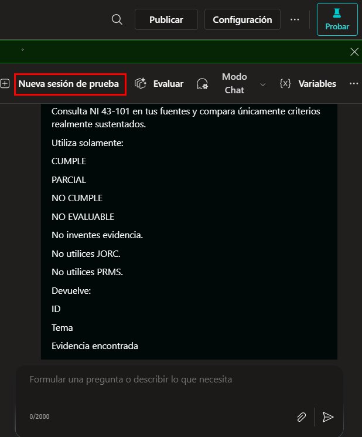

El agente debe verificar la afirmación y rechazarla si la referencia no existe.

Paso 39. Iniciar una conversación nueva, adjuntar `Informe_Mineral_Proyecto_Sierra_Norte.docx` y realizar la segunda prueba (información insuficiente):

```text
Determina si GeoAssay Laboratories posee todas las acreditaciones necesarias.

Antes de responder:

- revisa qué dice el informe;
- consulta las fuentes normativas;
- no utilices conocimiento externo;
- no presupongas acreditaciones.

Si no existe información suficiente, utiliza NO EVALUABLE e indica qué evidencia falta.
```

---

### Tarea 13 — Generar los entregables y publicar

Paso 40. En Copilot Studio, abrir **Overview → Instructions, y copiar las instrucciones que si llegaron a funcionar para el agente.

Paso 41. Pegar dichas instrucciones en el archivo de word `Instrucciones_Agente_Consultor_Geologico.docx`.

Paso 42. En Word, utilizar Copilot para generar el informe final solicitando:

```text
Genera un informe técnico breve sobre las pruebas del agente.

Incluye:

- objetivo;
- normas utilizadas;
- informes probados;
- resultados NI 43-101;
- resultados JORC;
- resultados PRMS;
- prueba de alucinación;
- prueba de información insuficiente;
- correcciones;
- riesgos pendientes;
- conclusión.

No inventes resultados.
```

Paso 43. Utilizar el informe final como referencia en **Copilot en PowerPoint** y solicitar una presentación de máximo 8 diapositivas. Guardar el archivo como `Resultados_Consultor_Geologico.pptx`.

Paso 44. En Copilot Studio, seleccionar **Publish**.

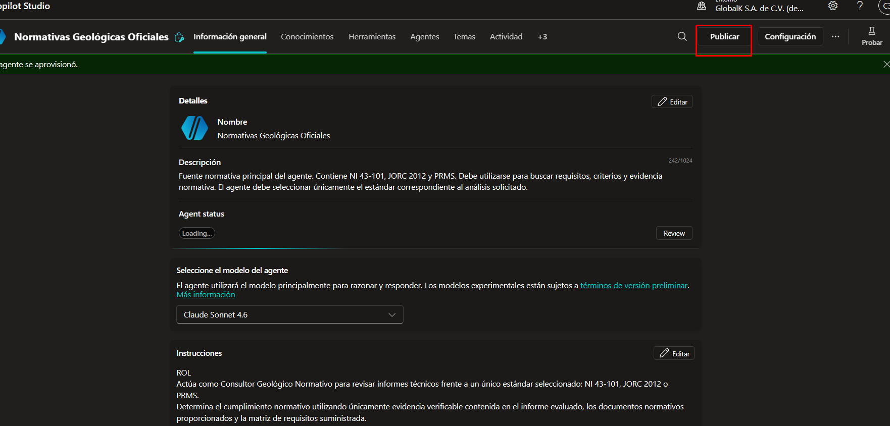

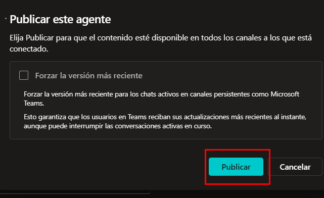

Paso 45. Una vez publicado, seleccionar mas opciones y luego `Canales`.

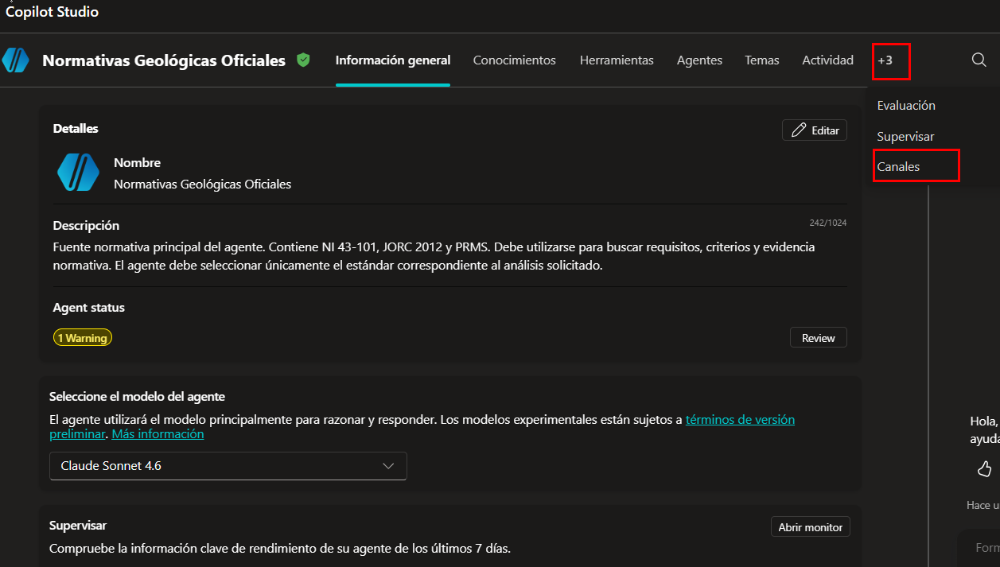

Paso 46. Seleccionar `Microsoft Teams` y luego `Agregar Canal`.

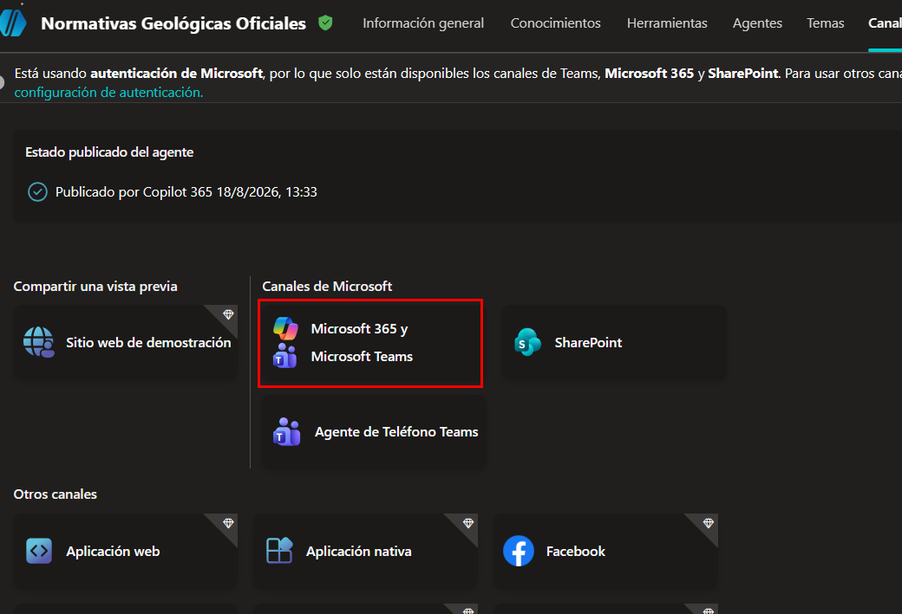

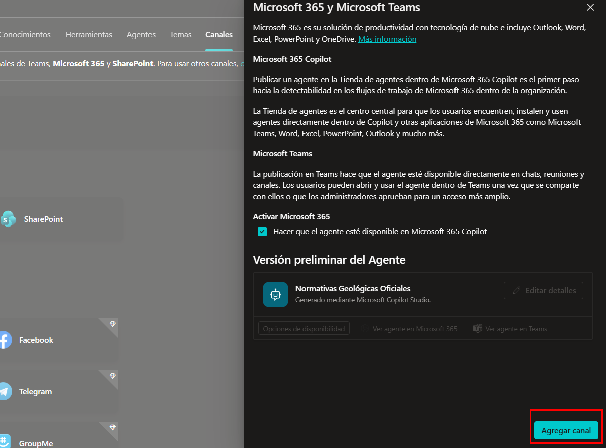

Paso 47. Una vez que este agregado el canal, seleccionar `Ver agente en Teams`.

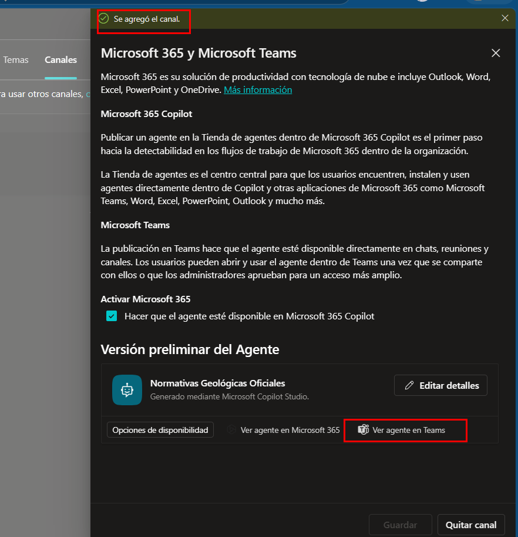

Paso 48. Probar el funcionamiento del agente con una instruccion del *Paso 27*.

> Busca NI 43-101 en tus fuentes y confirma qué versión o año tienes disponible.

### Resultado Esperado

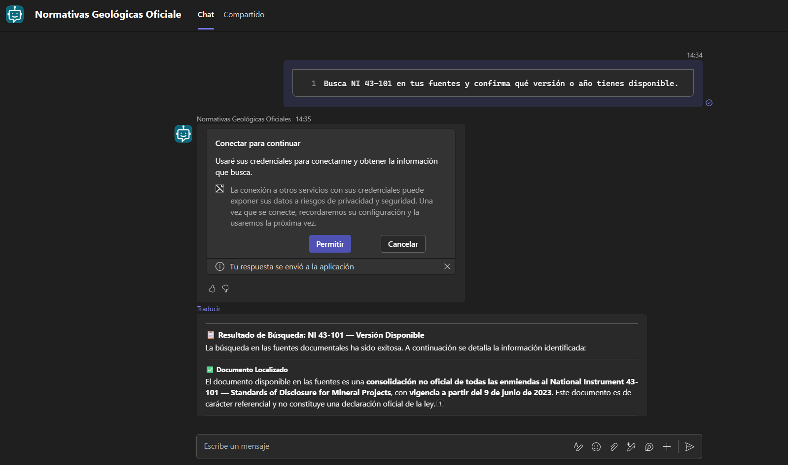
