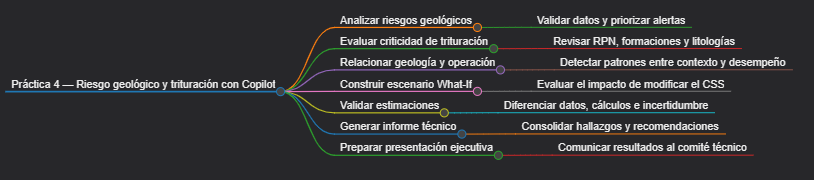
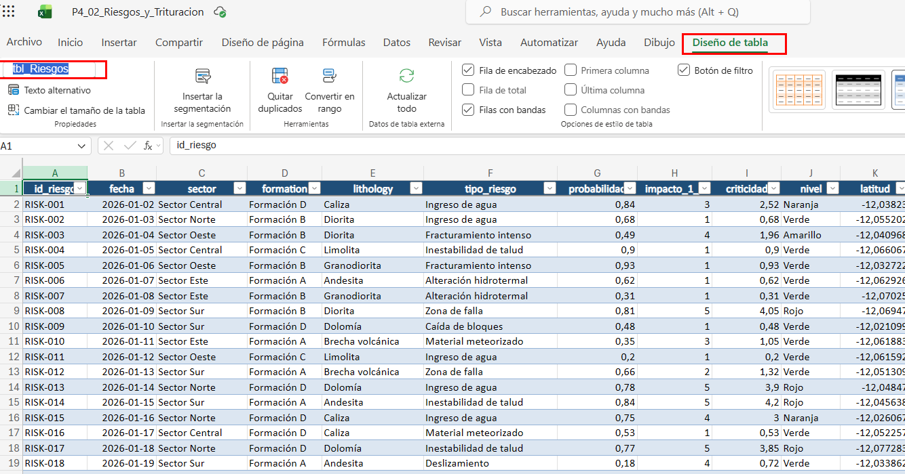
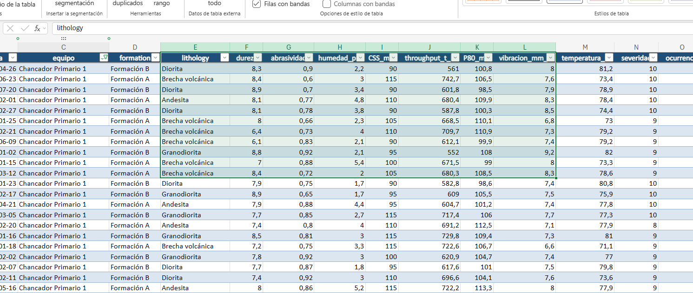
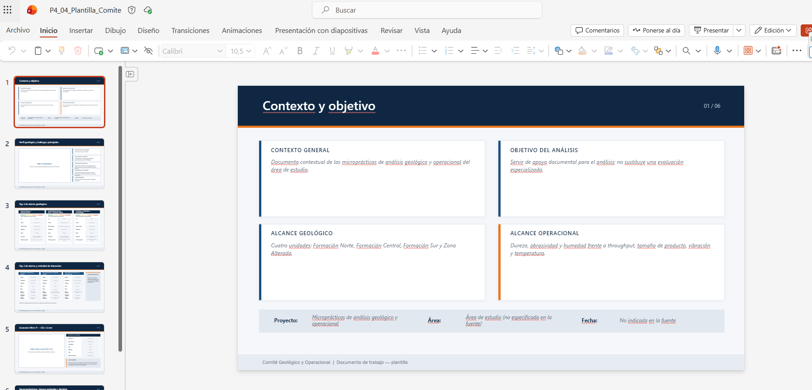

# Guía de laboratorio: Uso de Copilot para transformar datostabulares en descripciones para mapas o perfiles. Generación de alertas de riesgo geológico, evaluación predictiva de escenarios de fallas en modelos de trituración según tipos de formación, y preparación de presentaciones técnicas para comités.

## Objetivo de la práctica

Al final de la actividad, serás capaz de aplicar Microsoft Copilot Chat para transformar datos tabulares geológicos crudos en descripciones narrativas estructuradas aptas para mapas geológicos y perfiles estratigráficos interpretados.

## Objetivo Visual



## Duración aproximada

- 50 minutos.

## Instrucciones

### Tarea 1 — Generar y priorizar alertas de riesgo geológico con Copilot en Excel

Paso 1. Abrir `P4_02_Riesgos_y_Trituracion.xlsx` en Excel. En la parte inferior del libro, seleccionar la hoja `Riesgos`. Hacer clic dentro de cualquier celda que contenga datos. Si los datos todavía no están convertidos en tabla: presionar **Ctrl + T**, comprobar que Excel haya seleccionado todo el rango, activar **La tabla tiene encabezados** y seleccionar **Aceptar**. Ir a **Diseño de tabla** y cambiar el nombre de la tabla por `tbl_Riesgos`. Esto facilita que Copilot identifique correctamente el conjunto de información.



Paso 2. Abrir **Copilot en Excel** y pedir que comprenda la estructura antes de generar alertas:

```text
Analiza únicamente la tabla tbl_Riesgos de este libro.

Antes de interpretar los riesgos, identifica las columnas disponibles y explícame qué representa cada una.

Comprueba especialmente si existen las columnas: id_riesgo, fecha, sector, tipo_riesgo, probabilidad, impacto_1_5, criticidad, latitud, longitud, evidencia, medida_control.

Indica también: valores vacíos; columnas con tipos de datos incorrectos; probabilidades fuera del rango 0 a 1; impactos fuera del rango esperado; registros duplicados por id_riesgo.

No corrijas todavía los datos. Primero muéstrame los problemas encontrados.
```

Paso 3. Seleccionar la hoja `Criterios` y pedir a Copilot verificar las reglas que se utilizarán:

```text
Analiza la hoja Criterios y enumera las reglas disponibles para clasificar alertas y riesgos.

No inventes ningún umbral que no esté escrito en esta hoja.

Devuelve una tabla con: criterio; valor o rango; nivel asociado; acción recomendada; observaciones.
```

Paso 4. Regresar a la hoja `Riesgos`. La criticidad geológica se determinará a partir de Probabilidad × Impacto. Pedir a Copilot en Excel:

```text
Comprueba si la columna criticidad corresponde en cada fila a: probabilidad × impacto_1_5.

Identifica únicamente las filas donde el resultado almacenado sea diferente del cálculo.

Devuelve: id_riesgo; probabilidad; impacto; criticidad almacenada; criticidad calculada; diferencia.
```

Si Copilot detecta errores, pedir:

```text
Corrige únicamente los valores de la columna criticidad que no coincidan con probabilidad × impacto_1_5. No modifiques las demás columnas.
```

Paso 5. En la misma hoja de `Riesgos`, ordenar manualmente los riesgos para comprobar a Copilot. Hacer clic en una celda de `tbl_Riesgos`, ir a **Datos → Filtro**. En la columna `criticidad`, hacer clic en la flecha del encabezado y seleccionar **Ordenar de mayor a menor**.

Paso 6. Generar el Top 3 con Copilot en Excel con el siguiente prompt:

```text
Analiza tbl_Riesgos utilizando exclusivamente las reglas de la hoja Criterios.

Ordena los riesgos de mayor a menor prioridad.

Selecciona los tres riesgos que deberían elevarse al comité técnico.

Para cada uno muestra: posición; id_riesgo; fecha; sector; tipo_riesgo; probabilidad; impacto; criticidad; nivel; evidencia disponible; medida de control existente; razón por la cual fue priorizado.

No inventes medidas de control. Si la evidencia es insuficiente, indícalo expresamente.
```

Paso 7. Generar las alertas narrativas mediante Microsoft 365 Copilot Chat iniciando una conversación nueva y adjuntar `P4_02_Riesgos_y_Trituracion.xlsx` y `P4_03_Contexto_Geologico.docx`. Pedir primero la revisión de las fuentes:

```text
Trabajaremos con dos archivos:
1. P4_02_Riesgos_y_Trituracion.xlsx
2. P4_03_Contexto_Geologico.docx

Primero revisa la hoja Riesgos, la hoja Criterios y la sección de criterios de riesgos del documento Word.

Indícame qué reglas y umbrales encuentras y de qué archivo proviene cada uno. No generes todavía las alertas.
```

Después de recibir la comprobación, utilizar:

```text
Ahora genera las tres alertas geológicas prioritarias.

Cada alerta debe contener: ALERT_ID; riesgo; sector; nivel; criticidad; evidencia; posible consecuencia; medida de control documentada; fuente exacta; fila o identificador de origen; incertidumbres.

Diferencia claramente: DATO OBSERVADO, INTERPRETACIÓN, RECOMENDACIÓN.

No agregues hechos que no estén en los archivos.
```

---

### Tarea 2 — Evaluar criticidad y fallas del sistema de trituración

Paso 8. Abrir `P4_02_Riesgos_y_Trituracion.xlsx`, seleccionar la hoja `Trituracion`, convertir los datos en tabla con **Ctrl + T** y denominarla `tbl_Trituracion`.

Paso 9. Pedir a Copilot en Excel que identifique las variables:

```text
Analiza únicamente tbl_Trituracion.

Identifica qué columnas corresponden a: equipo, formación, litología, dureza, abrasividad, humedad, CSS, throughput, P80, vibración, temperatura, severidad, ocurrencia, detección, RPN.

Identifica valores vacíos, valores fuera de rango y datos que podrían impedir el cálculo del RPN. No realices aún la interpretación.
```

Paso 10. Comprobar el cálculo de RPN con Copilot pidiendo:

```text
Comprueba fila por fila si: RPN = severidad × ocurrencia × detección.

Muéstrame únicamente los registros donde el valor RPN almacenado no coincida con el cálculo. No modifiques todavía la tabla.
```

Si existen errores:

```text
Corrige únicamente los valores RPN incorrectos utilizando: severidad × ocurrencia × detección.
```

Paso 11. En el encabezado `RPN`, abrir la flecha del filtro y seleccionar **Ordenar de mayor a menor** para revisar los registros más críticos en la parte superior.

Paso 12. Hacer clic en la flecha de la columna `formation`, desmarcar **Seleccionar todo** y marcar una sola formación (por ejemplo, Formación A). Pulsar **Aceptar**. Luego abrir nuevamente el filtro y seleccionar **Borrar filtro de "formation"**. Hacer el mismo ejercicio con `lithology`.

Paso 13. Pedir a Copilot que compare formaciones y litologías:

```text
Agrupa conceptualmente los registros de tbl_Trituracion por: formation y lithology.

Para cada grupo calcula o resume: cantidad de registros; RPN promedio; RPN máximo; throughput promedio; P80 promedio; vibración promedio; temperatura promedio.

Identifica qué formaciones y litologías concentran los valores más altos de RPN. No presentes correlación como causalidad.
```

Paso 14. Crear una tabla dinámica para comprobar los resultados: hacer clic dentro de `tbl_Trituracion`, ir a **Insertar → Tabla dinámica**, seleccionar **Nueva hoja de cálculo** y pulsar **Aceptar**. Arrastrar `formation` a **Filas**, `lithology` debajo de `formation`, `RPN`, `throughput_t_h` y `vibracion_mm_s` a **Valores**. Cambiar la configuración de campo de valor de **Suma** a **Promedio** para los tres.

Paso 15. Seleccionar una celda dentro de la tabla dinámica y preguntar a Copilot:

```text
Interpreta esta tabla dinámica.

Indica: qué formación tiene mayor RPN promedio; qué litología tiene mayor RPN; dónde aparece mayor vibración; qué grupos presentan menor throughput; qué combinaciones requieren revisión.

Para cada hallazgo menciona el dato utilizado como evidencia.
```

Paso 16. Abrir Microsoft 365 Copilot Chat y adjuntar `P4_02_Riesgos_y_Trituracion.xlsx`, `P4_01_Perfil_Geologico.xlsx` y `P4_03_Contexto_Geologico.docx`. Pedir la primera revisión:

```text
Revisa los tres archivos adjuntos.

Localiza en P4_02_Riesgos_y_Trituracion.xlsx las formaciones y litologías presentes en la hoja Trituracion. Después busca esas mismas formaciones y litologías en P4_01_Perfil_Geologico.xlsx. Finalmente revisa si P4_03_Contexto_Geologico.docx aporta información adicional sobre ellas.

Devuelve una tabla de correspondencias. No interpretes todavía el comportamiento de trituración.
```

Después pedir la comparación de contexto y operación:

```text
Ahora compara el contexto geológico con los registros operacionales.

Identifica coincidencias entre: formación, litología, dureza, abrasividad, humedad, RPN, vibración, throughput, P80.

Para cada patrón indica: 1. evidencia; 2. archivos de origen; 3. número de registros; 4. posible interpretación; 5. nivel de confianza.

No conviertas una asociación estadística en una causa confirmada.
```

Paso 17. Obtener el Top 3 de alertas de trituración con el siguiente prompt:

```text
Selecciona las tres condiciones de trituración de mayor prioridad.

Prioriza utilizando: RPN; driver principal; vibración; temperatura; impacto operacional; contexto geológico.

Devuelve: ALERT_ID, Equipo, Formación, Litología, RPN, Nivel, Driver principal, Parámetro anómalo, Evidencia, Acción propuesta, Fuente, Incertidumbre.
```

---

### Tarea 3 — Construir un escenario What-If de trituración con Copilot y Excel

Paso 18. En la hoja `Trituracion` de `P4_02_Riesgos_y_Trituracion.xlsx`, utilizar el filtro de `equipo` para seleccionar únicamente el equipo de interés (por ejemplo: Chancador Primario 1).

Paso 19. En la columna `RPN`, abrir el filtro y seleccionar **Ordenar de mayor a menor**. Anotar los datos (formation, lithology, CSS actual, throughput, P80, vibración, RPN) del primer registro visible.



Paso 20. Pedir a Copilot en Excel que busque evidencia histórica antes de simular:

```text
Para el registro visible de mayor RPN, identifica: equipo; formación; litología; CSS; throughput; P80; vibración; RPN.

Ahora busca dentro de tbl_Trituracion otros registros del mismo equipo y, preferentemente, de la misma formación y litología. Compara los casos donde el CSS sea diferente.

Devuelve una tabla con los registros comparables. No hagas todavía una predicción.
```

Paso 21. Verificar si existen datos suficientes con el siguiente prompt:

```text
Con los registros comparables encontrados, determina si existe información suficiente para estimar el efecto de aumentar el CSS en 5 mm.

Evalúa: cantidad de observaciones; rango de CSS disponible; presencia de registros próximos a CSS actual +5 mm; consistencia de formation y lithology; variabilidad de throughput; variabilidad de P80; variabilidad de RPN.

Clasifica la evidencia como: SUFICIENTE, LIMITADA, o INSUFICIENTE. Explica el motivo.
```

Paso 22. En una nueva hoja de Excel crear la tabla `Escenario_WhatIf` con las columnas: Variable, Actual, Escenario CSS +5 mm, Diferencia, Confianza, y las filas CSS, Throughput, P80, Vibración, RPN. Pedir a Copilot completarla:

```text
Ayúdame a completar la tabla Escenario_WhatIf.

El cambio a evaluar es: CSS escenario = CSS actual + 5 mm.

Para throughput, P80, vibración y RPN utiliza únicamente evidencia histórica comparable de tbl_Trituracion. Si los datos permiten una estimación numérica razonable, calcula el valor e indica el método. Si los datos no son suficientes, escribe: "Sin evidencia suficiente para estimación cuantitativa". No inventes porcentajes.
```

Paso 23. Si Copilot propone una fórmula predictiva, preguntar:

```text
Explica la fórmula que propones. Indica: variable independiente; variable dependiente; registros utilizados; limitaciones; supuestos; por qué consideras que puede utilizarse para un escenario didáctico. No la presentes como modelo predictivo validado.
```

Paso 24. Seleccionar la tabla `Escenario_WhatIf` y las filas numéricas clave. Ir a **Insertar → Gráfico de columnas → Columnas agrupadas** para comparar "Actual vs. CSS +5 mm" y nombrar el gráfico **Escenario What-If — CSS +5 mm**.

Paso 25. Pedir a Copilot en Excel que interprete el escenario:

```text
Interpreta el escenario CSS +5 mm.

Separa la respuesta en: 1. Valores observados actuales. 2. Estimaciones del escenario. 3. Posible impacto operacional. 4. Incertidumbres. 5. Riesgos residuales.

Finaliza con una de estas decisiones: PROBAR, NO PROBAR, o REQUIERE MÁS DATOS. Justifica la decisión exclusivamente con información del archivo.
```

Paso 26. Adjuntar en Copilot Chat `P4_02_Riesgos_y_Trituracion.xlsx` y `P4_03_Contexto_Geologico.docx` para validar el escenario. Primero solicitar:

```text
Revisa la hoja Trituracion, la hoja Escenario_WhatIf y el documento de contexto. Comprueba primero que los valores utilizados como situación actual existan realmente en Trituracion. Comprueba después qué valores del escenario son observados, calculados o estimados. No emitas todavía una recomendación.
```

Después auditar el escenario:

```text
Ahora audita el escenario CSS +5 mm. Identifica cualquier afirmación que no esté respaldada por datos. Devuelve: conclusión, evidencia, supuestos, incertidumbre, recomendación binaria, datos adicionales necesarios.
```

---

### Tarea 4 — Crear el informe técnico con Copilot en Word

Paso 27. Abrir Word, seleccionar **Documento en blanco** y guardarlo inmediatamente como `P4_Informe_Tecnico.docx`.

Paso 28. Desde los archivos de Excel de origen, copiar y pegar en el documento de Word las tablas y gráficos relevantes: tabla de intervalos, gráfico del perfil geológico, Top 3 de riesgos, Top 3 de alertas de trituración, gráfico y tabla de `Escenario_WhatIf`.

Paso 29. Abrir Copilot en Word y pedir la creación de la estructura:

```text
Utilizando exclusivamente el contenido que ya está incluido en este documento, crea la estructura de un informe técnico con las siguientes secciones: 1. Objetivo, 2. Contexto geológico, 3. Perfil geológico interpretado, 4. Riesgos geológicos, 5. Criticidad del sistema de trituración, 6. Escenario What-If, 7. Riesgos residuales, 8. Recomendaciones, 9. Conclusiones.

No inventes información que no aparezca en las tablas o gráficos.
```

Paso 30. Seleccionar la tabla y el gráfico del perfil geológico y pedir la redacción:

```text
Redacta la sección "Perfil geológico interpretado" utilizando únicamente esta tabla y este gráfico. Diferencia: datos observados, contactos identificados, interpretaciones, incertidumbres. No agregues litologías ni formaciones inexistentes.
```

Paso 31. Seleccionar el Top 3 de riesgos y pedir la redacción:

```text
Redacta la sección "Riesgos geológicos". Para cada alerta incluye: ID, riesgo, nivel, evidencia, posible impacto, control existente. Ordena la sección de mayor a menor prioridad y conserva los identificadores para garantizar trazabilidad.
```

Paso 32. Seleccionar la tabla del Top 3 de trituración y pedir la redacción:

```text
Redacta la sección "Criticidad del sistema de trituración". Explica: cuáles son las tres alertas principales, sus RPN, drivers, formación, litología y parámetros operacionales relevantes. No presentes asociaciones entre geología y fallas como causalidad confirmada.
```

Paso 33. Seleccionar la tabla `Escenario_WhatIf` y el gráfico, y pedir la redacción:

```text
Redacta la sección "Escenario What-If CSS +5 mm". Incluye: situación actual, modificación analizada, impacto estimado sobre throughput, impacto estimado sobre P80, impacto sobre RPN, incertidumbres y recomendación. Identifica expresamente qué cifras son observadas y cuáles estimadas.
```

Paso 34. Cuando el informe esté completo, pedir la generación del resumen:

```text
Genera un resumen ejecutivo de máximo 250 palabras. Debe incluir: principal hallazgo geológico, Top 3 de riesgos, alerta de trituración más importante, resultado del What-If y recomendación para el comité. Utiliza únicamente el contenido del documento.
```

Paso 35. Hacer una revisión crítica del documento completo con Copilot:

```text
Actúa como revisor técnico del documento. Identifica: afirmaciones sin evidencia, cifras sin fuente, contradicciones, conclusiones demasiado fuertes, interpretaciones presentadas como hechos, y tablas que no coincidan con el texto.

Devuelve una lista de correcciones propuestas. No reescribas todavía el documento.
```

Aplicar únicamente las correcciones que puedan comprobarse.

---

### Tarea 5 — Preparar la presentación del comité con Copilot en PowerPoint

Paso 36. Abrir la plantilla `P4_04_Plantilla_Comite.pptx` y guardar una copia como `P4_Comite_Tecnico.pptx`.

Paso 37. En Copilot de PowerPoint indicar que la fuente principal será `P4_Informe_Tecnico.docx` y crear la presentación a partir del archivo.

Paso 38. Pedir la estructura exacta a Copilot en PowerPoint:

```text
Utiliza P4_Informe_Tecnico.docx como fuente principal. Reorganiza la presentación en exactamente seis diapositivas: 1. Contexto y objetivo, 2. Perfil geológico y hallazgos principales, 3. Top 3 de alertas geológicas, 4. Top 3 de alertas y criticidad de trituración, 5. Escenario What-If CSS +5 mm, 6. Recomendaciones, riesgos residuales y decisión solicitada.

Máximo cuatro mensajes principales por diapositiva. No inventes cifras. Mantén los IDs de las alertas cuando aparezcan.
```

Paso 39. Pegar el gráfico de perfil desde Excel en la diapositiva 2 y pedir:

```text
Resume el gráfico de la diapositiva 2 en tres mensajes técnicos. Utiliza únicamente los datos mostrados en el perfil. No conviertas inferencias geológicas en hechos confirmados.
```

Paso 40. Pegar la tabla del Top 3 de riesgos en la diapositiva 3 y pedir:

```text
Para esta diapositiva genera un mensaje ejecutivo de una línea para cada una de las tres alertas. Cada mensaje debe conservar: ID, nivel, principal evidencia y acción requerida.
```

Paso 41. Pegar la tabla de alertas de trituración en la diapositiva 4 y pedir:

```text
Resume esta tabla para un comité técnico. Destaca: equipo, RPN, driver principal, formación/litología relacionada y acción requerida. No elimines los valores RPN.
```

Paso 42. Pegar la tabla y gráfico de `Escenario_WhatIf` en la diapositiva 5 y pedir:

```text
Crea un resumen ejecutivo del escenario de esta diapositiva. Presenta únicamente: cambio evaluado, efecto esperado, beneficio potencial, principal riesgo, nivel de confianza y recomendación. Marca expresamente cualquier valor estimado.
```

Paso 43. Para la diapositiva 6 pedir la conclusión a Copilot:

```text
Utilizando solamente las cinco diapositivas anteriores y el informe técnico, crea la diapositiva final para el comité.

Incluye: RECOMENDACIONES PRIORITARIAS (máximo tres), RIESGOS RESIDUALES (máximo tres), DECISIÓN SOLICITADA AL COMITÉ (una única frase), y PRÓXIMO PASO (una única acción concreta). No agregues información externa.
```

Paso 44. Utilizar Copilot para revisar toda la presentación:

```text
Revisa las seis diapositivas como si fueras un miembro del comité técnico. Identifica: datos contradictorios, alertas sin fuente, cifras que no aparecen en el informe, exceso de texto, conclusiones sin evidencia, y diapositivas que no tengan un mensaje principal claro. Devuelve las correcciones diapositiva por diapositiva.
```

Paso 45. Generar notas del presentador con Copilot para cada diapositiva:

```text
Genera notas del presentador para explicar esta diapositiva en aproximadamente un minuto. Las notas ventar qué muestra el visual, destacar el dato más importante, diferenciar hechos de interpretaciones, y terminar con la conclusión que debe recordar el comité.
```

## Resultado Esperado


